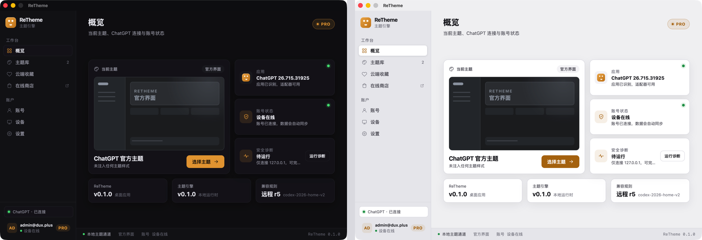
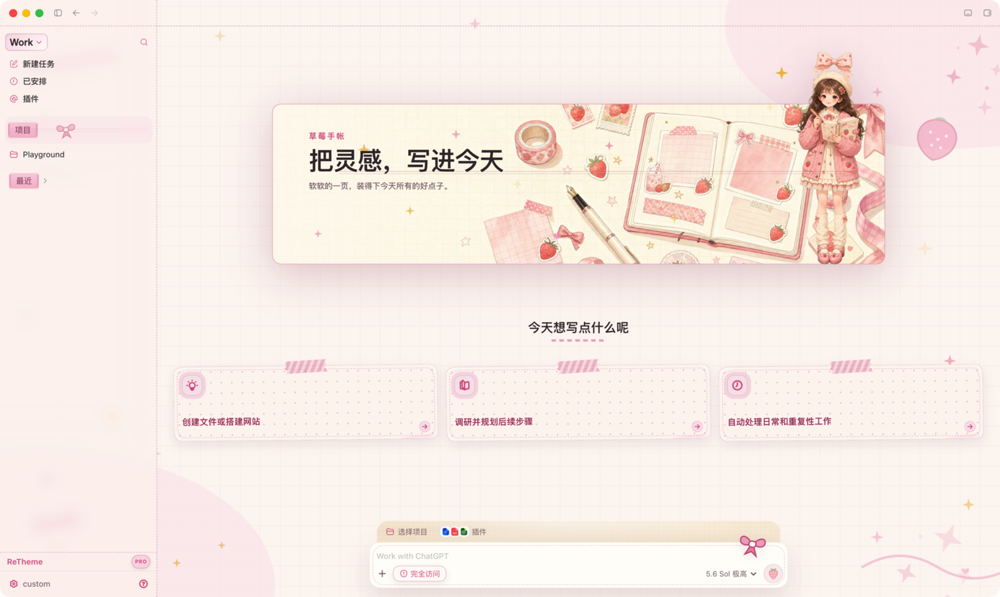

<p align="center">
  
</p>

<h1 align="center">ReTheme</h1>

<p align="center">
  为 ChatGPT 桌面端打造的安全、可更新、社区驱动主题引擎。<br>
  Tauri 2 + Rust · macOS 与 Windows · 中文与 English
</p>

<p align="center">
  <a href="https://retheme.app">官网</a> ·
  <a href="https://github.com/duxweb/ReTheme/releases">下载</a> ·
  <a href="docs/theme-development.md">主题开发</a> ·
  <a href="https://github.com/duxweb/ReTheme/issues">反馈</a>
</p>

<p align="center">
  简体中文 | <a href="README.en.md">English</a>
</p>

<p align="center">
  
</p>

---

ReTheme 把主题作者面对的稳定逻辑插槽与 ChatGPT 的版本适配分开。主题只声明颜色、样式、图片和双语文案；匹配规则由签名兼容数据独立更新，因此 ChatGPT 升级时通常无需重新发布主题或桌面应用。

## 主题预览

主题可以统一覆盖 ChatGPT 的背景、首页横幅、建议卡片、输入框、侧栏、菜单、图标、设置页与会话界面，同时保留原生交互和自适应布局。

### 齐天 · 暗色国风

<p align="center">
  
</p>

### 莓果 · 浅色手帐

<p align="center">
  
</p>

## 功能

| 能力 | 说明 |
|:--|:--|
| 主题运行时 | 覆盖首页、会话、输入框、侧栏、菜单、设置、卡片和装饰插槽 |
| 社区主题 | 通过 `retheme://` 深链下载，经平台签名验证后安装 |
| 本地开发 | 直接加载未打包主题目录，方便创作者实时调试 |
| 安全恢复 | 停止主题、退出 ReTheme 或安装更新前恢复 ChatGPT 官方界面 |
| 远程兼容 | 按 ChatGPT 版本获取签名适配数据，支持新旧版本并存 |
| 桌面体验 | 托盘、关闭隐藏、单实例、双语界面、深浅色与自动更新 |

ReTheme 桌面仓库不内置社区主题。主题在社区发布并按需下载，安装包保持精简。

## 下载

前往 [GitHub Releases](https://github.com/duxweb/ReTheme/releases) 下载：

- macOS Apple Silicon (`aarch64`)
- macOS Intel (`x86_64`)
- Windows x64 双语安装器（简体中文 / English）

首次启动后，ReTheme 会检测已安装的 ChatGPT。关闭主窗口会隐藏到托盘；请使用托盘菜单中的“退出 ReTheme”彻底退出。

## 主题开发

开发主题是普通目录，不需要 `.ctheme` 解密或平台签名。建议按以下顺序阅读：

1. [主题开发规范](docs/theme-development.md)：目录结构、Manifest、CSS、安全边界、双语和测试要求。
2. [可直接加载的最小参考主题](docs/theme-example/package) 与 [带注释 Manifest](docs/theme-example/manifest.annotated.jsonc)：从可运行代码开始修改。
3. [164 个稳定插槽](docs/theme-slots.md) 与 [Manifest JSON Schema](docs/theme.schema.json)：查找可覆盖区域和字段约束。
4. [Banner 与图片规格/生图提示词](docs/theme-banner-assets.md)：制作首页 Hero、会话窄 Banner 和透明前景素材。
5. [AI 主题开发工作流](docs/theme-ai-workflow.md)：让 AI 按固定步骤创建、校验和评审主题。

### 手工开发

复制最小主题，修改 `manifest.json`、`styles/` 和 `assets/`：

```bash
cp -R docs/theme-example/package /absolute/path/to/my-theme
```

```text
my-theme/
├── manifest.json
├── styles/
└── assets/
```

使用与桌面端、服务端相同的 Rust 协议校验器验证源码目录：

```bash
cargo run --manifest-path crates/theme-validator/Cargo.toml -- \
  --directory /absolute/path/to/theme
```

发布前还要校验最终 ZIP；ZIP 根目录必须直接包含 `manifest.json`：

```bash
cargo run --manifest-path crates/theme-validator/Cargo.toml -- \
  --source /absolute/path/to/theme.zip
```

然后在 ReTheme 的“主题库”中选择“加载本地主题”，选中主题目录进行实际测试。正式发布时上传源码 ZIP，由平台审核、规范化、签名并生成 `.ctheme`。

### 使用 AI Skill

仓库内置 [`retheme-theme-development`](skills/retheme-theme-development/SKILL.md) Skill，包含协议、插槽、QA、Banner 生图规范、校验脚本和起始模板。它适合让 Codex 等支持 Skills 的 AI 创建新主题、补全现有主题或判断问题属于主题还是引擎。

可以直接让 Codex 安装 GitHub 仓库中的 Skill：

```text
请安装 GitHub 仓库 duxweb/ReTheme 中 skills/retheme-theme-development 的 Skill。
```

也可以从本地仓库安装。macOS / Linux：

```bash
mkdir -p "${CODEX_HOME:-$HOME/.codex}/skills"
cp -R skills/retheme-theme-development "${CODEX_HOME:-$HOME/.codex}/skills/"
```

Windows PowerShell：

```powershell
$codexHome = if ($env:CODEX_HOME) { $env:CODEX_HOME } else { Join-Path $HOME ".codex" }
New-Item -ItemType Directory -Force (Join-Path $codexHome "skills") | Out-Null
Copy-Item -Recurse -Force skills/retheme-theme-development (Join-Path $codexHome "skills/retheme-theme-development")
```

安装后新开一个 Codex 会话，并直接描述任务，例如：

```text
使用 retheme-theme-development Skill，在 /path/to/my-theme 创建一套支持中英文和深浅模式的主题，完成校验但不要打包成 .ctheme。
```

AI 必须以共享校验器结果为准；不要为了迁就主题而放宽协议，也不要使用 ChatGPT 内部类名或改变原生布局。

## 本地开发

需要 Node.js 22、pnpm 10、Rust stable 与 Tauri 对应的系统依赖。

```bash
pnpm install
cp src-tauri/config/api.example.toml src-tauri/config/api.toml
cp src-tauri/config/security.example.toml src-tauri/config/security.toml
pnpm tauri dev
```

验证：

```bash
pnpm test
pnpm build
cargo test --manifest-path src-tauri/Cargo.toml
cargo clippy --manifest-path src-tauri/Cargo.toml --all-targets -- -D warnings
```

配置模板不包含生产密钥。维护者发版请阅读 [发布流程](docs/releasing.md)，安全边界见 [安全设计](docs/security.md)。

## 相关链接

- [主题开发规范](docs/theme-development.md)
- [稳定插槽目录](docs/theme-slots.md)
- [Banner 与图片规范](docs/theme-banner-assets.md)
- [AI 主题开发工作流](docs/theme-ai-workflow.md)
- [主题开发 Skill](skills/retheme-theme-development/SKILL.md)
- [Theme Development Guide](docs/theme-development.en.md)
- [安全设计](docs/security.md)
- [发版流程](docs/releasing.md)
- [开源协议](LICENSE)
- [ReTheme 官网](https://retheme.app)
- [LINUX DO 社区](https://linux.do/)
- [问题反馈](https://github.com/duxweb/ReTheme/issues)
